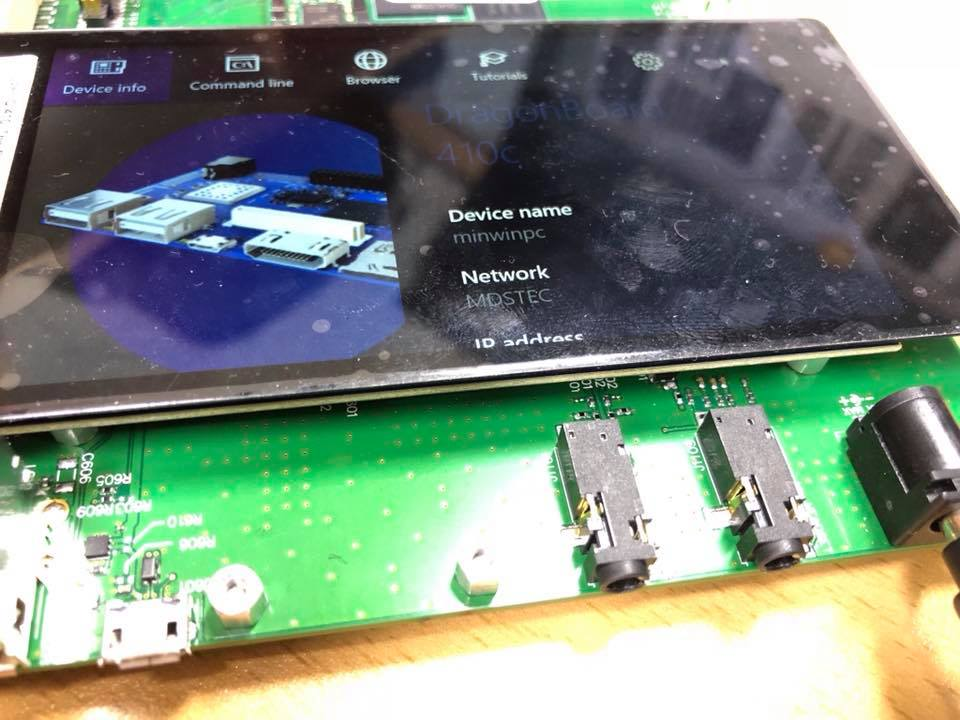

##JD9161 DSI 파일

Intrinsyc 의 Windows IoT Core 의 디스플레이 설정 파일인 panelcfg.asl 을 수정하여 눈읠 띄어 봤다 
Inrtinsyc 의 OpenQ410의 User Manual 을 보면 OSD045T2906-43TS,  JD9161BA 의 조합을 사용하는 것으로 확인했다. 

아래는 DSI 설정 값 

최종 panelcfg.asl 은 프로젝트를 참조 바란다. 

 static int8 mdss_dsi_jd9161_fwvga_vid[] = 
"<?xml version=\"1.0\" encoding=\"utf-8\"?>"
"<PanelName>JD9161 fwvga video mode dsi panel</PanelName>\n"
"<PanelDescription>JD9161 ((480x854xRGB)</PanelDescription>\n"
"<Group id='EDID Configuration'>\n"
"  <ManufactureID>0xAF0D</ManufactureID>\n"
"  <ProductCode>0x0011</ProductCode>\n"
"  <SerialNumber>0x000000</SerialNumber>\n"
"  <WeekofManufacture>0x09</WeekofManufacture>\n"
"  <YearofManufacture>0x13</YearofManufacture>\n"
"  <EDIDVersion>1</EDIDVersion>\n"
"  <EDIDRevision>3</EDIDRevision>\n"
"  <VideoInputDefinition>0x80</VideoInputDefinition>\n"
"  <HorizontalScreenSize>0x04</HorizontalScreenSize>\n"
"  <VerticalScreenSize>0x0D</VerticalScreenSize>\n"
"  <DisplayTransferCharacteristics>0x78</DisplayTransferCharacteristics>\n"
"  <FeatureSupport>0xA</FeatureSupport>\n"
"  <Red.GreenBits>0xCF</Red.GreenBits>\n"
"  <Blue.WhiteBits>0x45</Blue.WhiteBits>\n"
"  <RedX>0x90</RedX>\n"
"  <RedY>0x59</RedY>\n"
"  <GreenX>0x57</GreenX>\n"
"  <GreenY>0x95</GreenY>\n"
"  <BlueX>0x29</BlueX>\n"
"  <BlueY>0x1f</BlueY>\n"
"  <WhiteX>0x50</WhiteX>\n"
"  <WhiteY>0x54</WhiteY>\n"
"  <EstablishedTimingsI>0x0</EstablishedTimingsI>\n"
"  <EstablishedTimingsII>0x0</EstablishedTimingsII>\n"
"  <ManufacturesTiming>0x0</ManufacturesTiming>\n"
"  <StandardTimings1/>\n"
"  <StandardTimings2/>\n"
"  <StandardTimings3/>\n"
"  <StandardTimings4/>\n"
"  <StandardTimings5/>\n"
"  <StandardTimings6/>\n"
"  <StandardTimings7/>\n"
"  <SignalTimingInterface/>\n"
"</Group>\n"
"<Group id='Active Timing'>\n"
"  <HorizontalActive units='Dot Clocks'>480</HorizontalActive>\n"
"  <HorizontalFrontPorch units='Dot Clocks'>70</HorizontalFrontPorch>\n"
"  <HorizontalBackPorch units='Dot Clocks'>70</HorizontalBackPorch>\n"
"  <HorizontalSyncPulse units='Dot Clocks'>70</HorizontalSyncPulse>\n"
"  <HorizontalSyncSkew units='Dot Clocks'>0</HorizontalSyncSkew>\n"
"  <HorizontalLeftBorder units='Dot Clocks'>0</HorizontalLeftBorder>\n"
"  <HorizontalRightBorder units='Dot Clocks'>0</HorizontalRightBorder>\n"
"  <VerticalActive units='Dot Clocks'>854</VerticalActive>\n"
"  <VerticalFrontPorch units='Lines'>10</VerticalFrontPorch>\n"
"  <VerticalBackPorch units='Lines'>10</VerticalBackPorch>\n"
"  <VerticalSyncPulse units='Lines'>20</VerticalSyncPulse>\n"
"  <VerticalSyncSkew units='Lines'>0</VerticalSyncSkew>\n"
"  <VerticalTopBorder units='Lines'>0</VerticalTopBorder>\n"
"  <VerticalBottomBorder units='Lines'>0</VerticalBottomBorder>\n"
"  <InvertDataPolarity>False</InvertDataPolarity>\n"
"  <InvertVsyncPolairty>False</InvertVsyncPolairty>\n"
"  <InvertHsyncPolarity>False</InvertHsyncPolarity>\n"
"  <BorderColor>0x0</BorderColor>\n"
"</Group>\n"
"<Group id='Display Interface'>\n"
"  <InterfaceType units='QDI_DisplayConnectType'>8</InterfaceType>\n"
"  <InterfaceColorFormat units='QDI_PixelFormatType'>3</InterfaceColorFormat>\n"
"</Group>\n"
"<Group id='DSI Interface'>\n"
"  <DSIChannelId units='DSI_Channel_IDType'>1</DSIChannelId>\n"
"  <DSIVirtualId units='DSI_Display_VCType'>0</DSIVirtualId>\n"
"  <DSIColorFormat units='DSI_ColorFormatType'>36</DSIColorFormat>\n"
"  <DSITrafficMode units='DSI_TrafficModeType'>0</DSITrafficMode>\n"
"  <DSILanes units='integer'>2</DSILanes>\n"
"  <DSIHsaHseAfterVsVe units='Bool'>False</DSIHsaHseAfterVsVe>\n"
"  <DSILowPowerModeInHFP units='Bool'>False</DSILowPowerModeInHFP>\n"
"  <DSILowPowerModeInHBP units='Bool'>False</DSILowPowerModeInHBP>\n"
"  <DSILowPowerModeInHSA units='Bool'>False</DSILowPowerModeInHSA>\n"
"  <DSILowPowerModeInBLLPEOF units='Bool'>True</DSILowPowerModeInBLLPEOF>\n"
"  <DSILowPowerModeInBLLP units='Bool'>False</DSILowPowerModeInBLLP>\n"
"  <DSIRefreshRate units='integer Q16.16'>0x3C0000</DSIRefreshRate>\n"
"  <DSIPhyDCDCMode units='Bool'>False</DSIPhyDCDCMode>\n"
"  <DSITECheckEnable units='Bool'>True</<DSITECheckEnable>\n"
"</Group>\n"
"<DSIInitSequence>\n"
"  39 BF 91 61 F2\n"
"  39 B3 00 9B\n"
"  39 B4 00 9B\n"
"  39 C3 04\n"
"  39 B8 00 6F 01 00 6F 01\n"
"  39 BA 34 23 00\n"
"  39 C4 30 6A\n"
"  39 C7 00 01 32 05 65 2A 12 A5 A5\n"
"  39 C8 7F 6A 5A 4E 49 39 3B 23 37 32 2F 49 35 3B 31 2B 1E 0F 00 7F 6A 5A 4E 49 39 3B 23 37 32 2F 49 35 3B 31 2B 1E 0F 00\n"
"  39 D4 1E 1F 1F 1F 06 04 0A 08 00 02 1F 1F 1F 1F 1F 1F\n"
"  39 D5 1E 1F 1F 1F 07 05 0B 09 01 03 1F 1F 1F 1F 1F 1F\n"
"  39 D6 1F 1E 1F 1F 07 09 0B 05 03 01 1F 1F 1F 1F 1F 1F\n"
"  39 D7 1F 1E 1F 1F 06 08 0A 04 02 00 1F 1F 1F 1F 1F 1F\n"
"  39 D8 20 00 00 30 08 20 01 02 00 01 02 06 7B 00 00 72 0A 0E 49 08\n"
"  39 D9 00 0A 0A 89 00 00 06 7B 00 00 00 3B 33 1F 00 00 00 03 7B\n"
"  05 35\n"
"  39 BE 01\n"
"  39 C1 10\n"
"  39 CC 34 20 38 60 11 91 00 40 00 00\n"
"  39 BE 00\n"
"  05 11\n"
"  05 29\n"
"</DSIInitSequence>\n"
"<DSITermSequence>\n"
"  05 28 00\n"
"</DSITermSequence>\n";

#최종 패널 상태 
 

